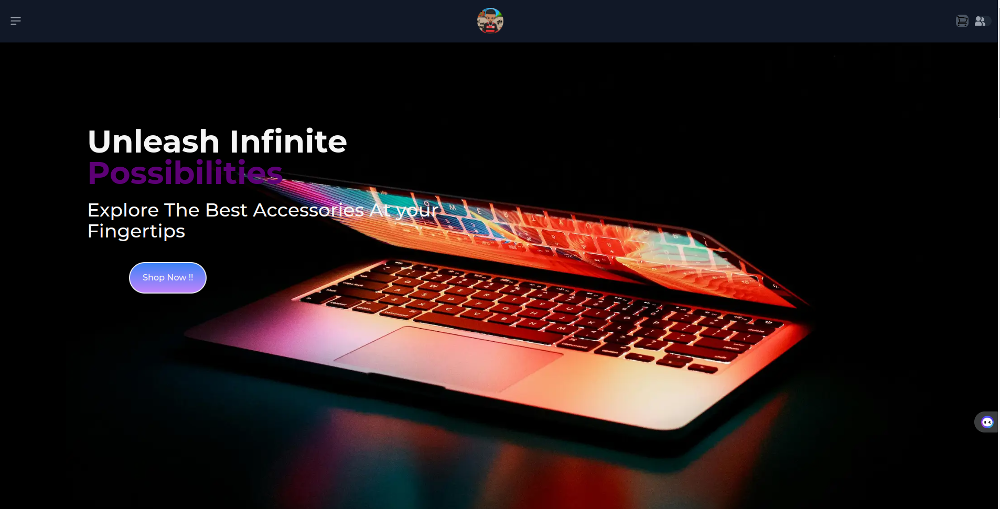

<p align="center">
  <p align="center">
    <a href="https://justdjango.com/?utm_source=github&utm_medium=logo" target="_blank">
      <!--  -->
    </a>
  </p>
  <p align="center">
    The Definitive Django Learning Platform.
  </p>
</p>

# Django Nextjs 13 Ecommerce


  


This is a full-featured e-commerce application built using Docker, Nginx, Next.js, and Django. The project is containerized using Docker and managed with Docker Compose.

## Technologies Used
- `Docker`: A platform to develop, ship, and run applications inside containers.
- `Nginx`: A web server used as a reverse proxy to manage requests to the Next.js and Django applications.
- `Next.js`: A React framework for building server-side rendered and statically generated applications.
- `Django`: A high-level Python web framework that encourages rapid development and clean, pragmatic design.

## Project Structure

```php
  project-root/
├── backend/
│   ├── my_app/
│   │   ├── Dockerfile         # Dockerfile for the Django application
│   │   ├── requirements.txt   # Python dependencies
│   │   ├── start              # Script to start the Django application
│   │   └── ...                # Other backend files
├── client/
│   ├── Dockerfile.dev         # Dockerfile for the Next.js application
│   ├── package.json           # Node.js dependencies
│   ├── .dockerignore          # Files to ignore in the Docker build context
│   └── ...                    # Other frontend files
├── docker-compose.yml          # Docker Compose configuration
└── nginx/
    ├── default.conf           # Nginx configuration
    └── Dockerfile             # Dockerfile for the Nginx server
```


## Getting Started

# Prerequisites

- `Docker`
- `Docker Compose`

## Installation 

1. `Clone the repository:`
```sh
  git clone https://github.com/ce-phus/FullStack-eshop.git
  cd FullStack-eshop

```
2. `Build and start the containers:`
```sh
  make build
```
3. `Apply migrations:`
```sh
  make migrate
```
4. `Create a superuser:`
```sh
  make superuser
```
5. `Access the application:`

Open your browser and go to http://localhost:8080. Nginx will forward the requests to the appropriate service based on the URL path.

## Configuration

# Docker Compose
The docker-compose.yml file defines the services, networks, and volumes used in the project.

# Nginx Configuration
The nginx/default.conf file configures Nginx to act as a reverse proxy, forwarding requests to the appropriate service based on the URL path.

# Django Settings
Ensure that the Django settings are correctly configured, including the database settings, allowed hosts, and static files configuration.


### Mpesa Sandbox Config (Daraja API)

```
Open browser, navigate to daraja mpesa and create account
Create and app api sandbox
create env file fill in the 
consumer_secret
consumer_key
shortcode
pass_key
access_token_url
checkout_url
test_c2b_shortcode
```
